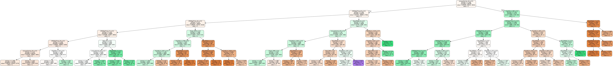

# Predicting flight delays and identifying patterns

## Methodology
1. Describe the average delays per airport/airline

2. Identify and report the most prominent rules of association between delays and point of origin AND/OR point of arrival
3. Predict the delay given all other features and report the appropriate performance on cross-validation

A DecisionTreeClassifier was used with an accuracy of 55.449%

4. Identify patterns/rules

See `pattern.txt` file

## Requiements
See the `requirements.txt` file